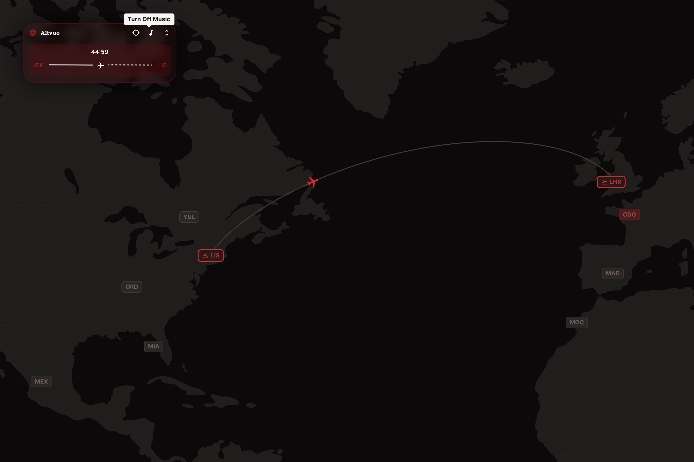

# Altvue

Altvue is an interactive focus-flight web app that turns a work session into a calm virtual journey between airports.

The site lets users choose a departure city and a destination city, then starts a timed "flight" across a world map. The route, flight duration, animated plane, countdown, progress state, and background audio all work together to create a focused session that feels more visual and immersive than a normal timer.

# Live Demo

https://altvue.vercel.app

# Overview

Altvue was built to make focus sessions feel less repetitive and more intentional. Standard timers usually show only a number counting down, which can feel static and easy to ignore. Altvue solves that by attaching the session to a visual journey: the user selects two real airport locations, starts the flight, and watches progress happen on the map while the timer runs.

The app is designed for people who want a structured focus period without a heavy productivity dashboard. The flight metaphor gives every session a clear start, destination, duration, and end state.

# Features

- Interactive world map powered by MapLibre GL, with airport markers rendered directly on the map.
- Airport and city data loaded from Supabase, including city names, countries, continents, airport codes, and coordinates.
- Departure and destination selectors with custom airport cards.
- Destination filtering by focus duration, so users can pick a flight length that matches the time they want to focus.
- Automatic focus-duration calculation based on the distance between selected cities.
- Curved route line between the selected departure and destination airports.
- Animated plane movement along the selected route during an active focus flight.
- Flight countdown, route progress, departure time, and arrival time display.
- Pause and resume controls that keep the timer, route progress, and animation in sync.
- Cancel flight control that resets the active session and map state.
- Camera lock mode that follows the plane during the flight, plus a free-camera mode for manual map exploration.
- Center map action to return the map to the default world view.
- Background flight audio loaded from Supabase.
- Seatbelt-style audio cues during the flight experience.
- Mute and unmute controls for the flight audio.
- Loading screen with a flight animation while initial data loads.
- Empty-data fallback popup that asks the user to reload if the city data does not load correctly.
- Responsive control panel with compact and expanded states.
- Instructions panel that explains the main controls inside the app.
- Custom SVG icon system for flight actions, map controls, music, instructions, and panel controls.

# Tech Stack

- Next.js 16
- React 19
- JavaScript
- Tailwind CSS 4
- MapLibre GL
- Supabase
- Supabase database tables for city and audio metadata
- Supabase Storage for public audio files
- Lottie React
- SVGR
- ESLint
- Vercel

# What I Built

- Built the full Altvue product concept around a focus timer that behaves like a flight journey instead of a basic countdown.
- Designed the main user flow from selecting a departure airport, selecting a destination, starting a flight, following progress, pausing or resuming, and completing or cancelling the session.
- Created the interactive MapLibre map experience, including airport markers, map initialization, map theming, marker state syncing, and map reset behavior.
- Developed the custom airport marker system with React-rendered marker components so selected, hovered, departure, and destination states are visually distinct.
- Built the route visualization layer that draws a curved path between the selected airports.
- Implemented the animated plane behavior that moves across the route based on the same timing model used by the flight countdown.
- Added camera-follow behavior so the map can stay locked to the plane during a flight, while still allowing the user to switch back to free camera mode.
- Built the main control panel with open, compact, instructions, center-map, audio, and camera controls.
- Created the departure and destination picker UI, including filtered destination groups by focus duration.
- Implemented focus-duration logic based on distance between city coordinates, turning real route distance into usable focus-session lengths.
- Connected the app to Supabase for city and airport data instead of relying on only local static data.
- Connected flight audio to Supabase, including public audio URLs, music tracks, and seatbelt-style cue tracks.
- Built the active-flight state model, including departure time, arrival time, elapsed time, paused time, remaining time, and progress.
- Added pause, resume, cancel, and completion behavior that keeps the UI, timer, audio, and map animation aligned.
- Added the loading and fallback states for cold visits, including a minimum loading screen and a reload popup when city data is unavailable.
- Designed the interface with a dark cockpit-inspired visual direction, crimson accents, custom icons, compact panels, and map-first layout.
- Followed a design-to-development process where the core experience was defined first, then broken into reusable atoms, molecules, organisms, hooks, utilities, and data APIs.
- Organized the frontend into reusable component layers so the map, panel, selectors, buttons, tooltips, flight controls, and route logic can evolve independently.
- Refined the experience around user feedback, especially the first-visit Supabase loading behavior and the controls needed during an active focus flight.

## Getting Started

Clone the repository:
